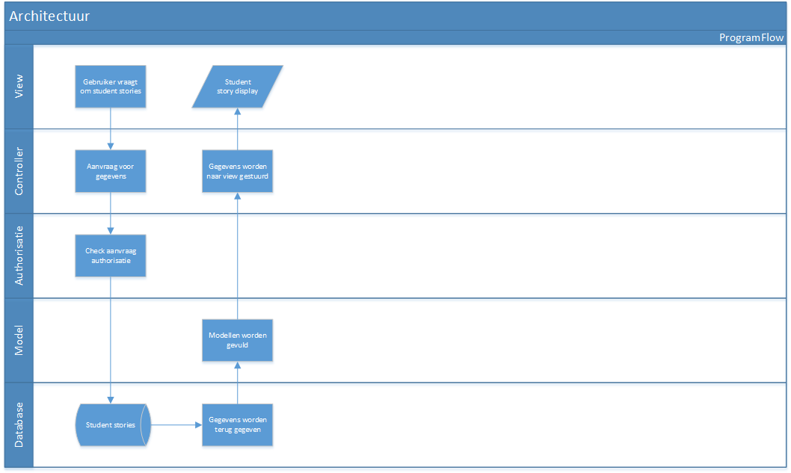

#Architectuur
Onze architectuur is gebasseerd op MVC, met een paar lagen meer. Dit kan ook wel union architecture genoemd worden. Hieronder een overzicht van één van de acties die uitgevoerd kunnen worden met daarbij welke lagen er gebruikt worden:

Onze hooglevel overview, hiermee wordt bedoeld welke servers er gebruikt worden, ziet er als volgt uit:

