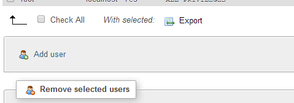
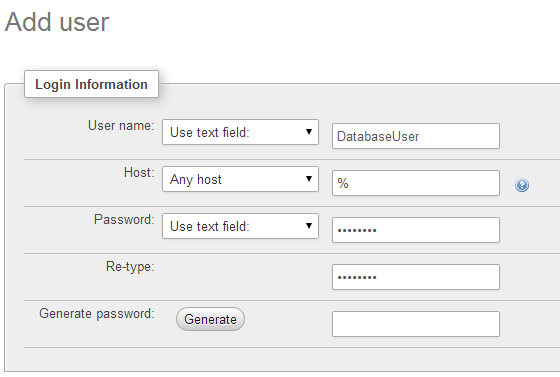
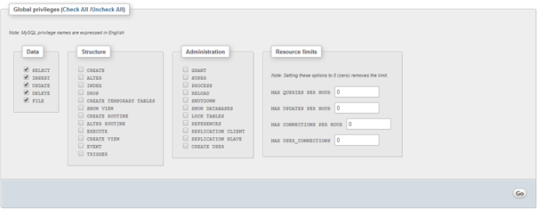
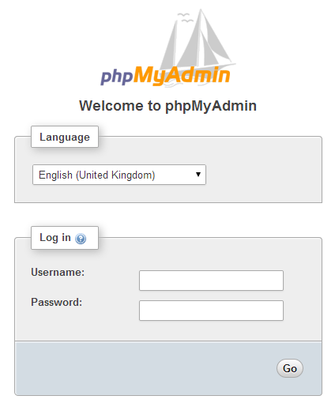
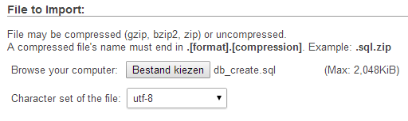
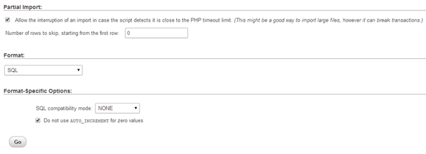

#Installation Guide: server
The software was tested on a system running the following software:
* Ubuntu 13.10 Server
* Apache 2.4.6
* Php 5.5.3
* MySQL 5.5.35
* PhpMyAdmin 4.4.6deb1

For Ubuntu, all software can be installed using sudo apt-get install.

Commands:
* **sudo apt-get update**
* **sudo apt-get install apache2**  
Confirm with Y
* **sudo apt-get install mysql-server php5-mysql**  
Confirm with Y
Enter a password for the root user when prompted (remember this password)
* **sudo mysql_install_db**  
* **sudo /usr/bin/mysql_secure_installation**  
Enter the mysql root password as you set it above
hit n to not change the password
enter Y to accept all other options
* **sudo apt-get install pgp5 libapache2-mod-php5 php5-mcrypt**  
Confirm with Y
* **sudo nano /etc/apache2/mods-enabled/dir.conf**  
Add index.php before index.html
ctrl-x to exit
Y to save
enter to confirm location (don’t change it)
* **sudo apt-get install phpmyadmin**  
when prompted, select apache2
when prompted, select Yes to configure phpmyadmin with dbconfig-common
when prompted, enter the MySQL root password
when prompted, choose a password for phpmyadmin and confirm it
* **sudo nano /etc/apache2/apache2.conf**  
add this to the end of the file: Include /etc/phpmyadmin/apache.conf
Save and exit in the same way as above (ctrl-x, Y, enter)
* **sudo ln -s /usr/share/phpmyadmin /var/www/phpmyadmin**  
* **sudo nano /etc/php5/mods-available/json.ini**  
uncomment the priority=20 line (remove ; at the beginning of the line)
save and exit (ctrl-x, Y, enter)

All required software should be installed and running.
Confirm that it works by navigating to the server IP (this can be found with **ifconfig eth0 | grep inet | awk ‘{ print $2 }’**)
Add /phpmyadmin to the end of the URL to confirm that phpmyadmin works.
You should be able to login to phpmyadmin with username ‘**root**’ and the root password you entered earlier.

##In Phpmyadmin 
1. Go to Users  
  
2. Click “add user”  
  
3. Fill in a username, password and set the host to “Any host”. Note: Use a different password than your root password for safety.  
  
4. Make sure all data privileges are selected (**SELECT, INSERT, UPDATE, DELETE, FILE**), and all other privileges are unselected.  
  
5. All files in web.zip should be unpacked into the web root folder (**/var/www**)  
5. Enter the login info for the new MySQL account into db/connection.php  

#Installation Guide: database

File needed:
* db_create.sql

1. Make sure the software on the server is up to date and running  
2. Login on phpMyAdmin with your MySQL root account  
  
3. Click on “Import"  
  
4. Select the “db_create.sql”  
  
5. Keep the other settings on default  
6. Click on “Go”  
  
7. Now you have successfully installed your database  